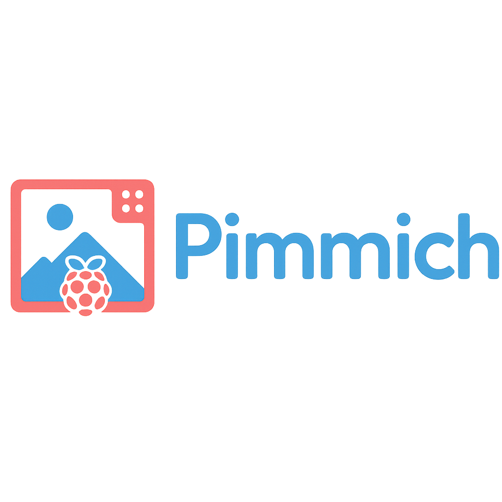

# 🖼️ Pimmich – Cadre photo connecté intelligent

Pimmich est une application Python conçue pour transformer un Raspberry Pi en cadre photo numérique intelligent, capable d'afficher des albums hébergés sur un serveur Immich ou sur une clé USB.



---

## ✨ Fonctionnalités

- 🔒 Interface sécurisée avec login
- 🖼️ Slideshow dynamique avec effet Pan & Zoom
- 🌐 Intégration avec l’API Immich (récupération automatique d’albums)
- 📂 Support de la clé USB comme source alternative d’images
- 🕒 Horaires configurables pour l’affichage automatique
- 💡 Interface web locale pour la configuration (http://IP-du-Pi:5000)
- ⚙️ Multi-albums sélectionnables
- 🔌 Boutons de redémarrage et extinction du système

---

## 🧰 Technologies utilisées

- Python 3.9+
- Flask
- Requests
- Pillow
- Tkinter (interface du slideshow)
- Immich API

---

## 📦 Installation

### ✅ Pré-requis

- Raspberry Pi avec Raspberry Pi OS Lite (32-bit ou 64-bit)
- Connexion Internet
- Python 3.9 compilé
- Clavier + écran pour la première configuration, ou SSH

### 📁 Cloner le dépôt

```bash
git clone https://github.com/gotenash/pimmich.git
cd pimmich
