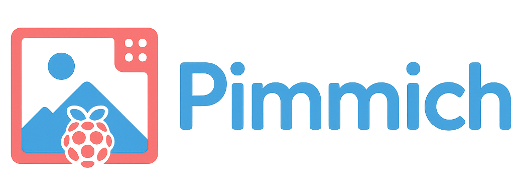

📣 Announcement - (June 14, 2025) : Nouvelle release en ligne

-  aperçus des photos avec possibilité de supprimer des photos
-  une vrai mise en veille de l'écran pas juste un écran noir

 J'essaierai de publier un release par mois avec des avancées significatives


# 🗺️ Feuille de route Pimmich

> 📆 À partir de juin 2025 — Une version majeure chaque mois

## ✅ Juin 2025 – Version actuelle

- ✅ Aperçus des photos avec suppression possible  
- ✅ Véritable mise en veille de l’écran (gestion via `wlr-randr`)  
- ✅ Paramètre de hauteur utile de l’écran (% d’écran utilisé)  
- ✅ Correction de l’orientation via EXIF et préparation des images  

## 🛠️ Juillet 2025 – Prochaine version (sortie prévue 14 juillet)

- ✅ 🧭 Ajout de la configuration Wi-Fi depuis l’interface Web  
- ✅ 🗂️ Réorganisation de la page de configuration en onglets  
- ✅ 🔁 Mise à jour automatique périodique de l’album Immich  
- ✅ 📁 Support du protocole SMB pour accéder à des photos partagées en réseau
- ✅ ⏰🌤️ Affichage de l’heure et de la météo sur l’écran
- ✅ Ajout NGINX, plus besoin de mettre le numéro du port (50000)
- ✅ Ajout des filtres (NB, Sépia, POlaroid ...)
- ✅ Ajout des différents boutons supprimer
- ✅ Ajout d'une option de sauvegarde de la configuration
- ✅ Ajout d'un menu changement du mot de passe
- ✅ Ajout de la création du credenrials.json pendant le setup
- ✅ Ajout effet de transition
- ✅ Ajout détection automatoique de la résolution
- ✅ Ajout de l'import à partir d'un smartphone (en admin et mode invité)
- ✅ Interface de validation des photos proposées en mode invité
- ✅ Ajout des logs dans l'onglet Système
- ✅ Ajout des stats du Raspberry (température, stockage Ram, charge processeur)

 
## 💡 Idées pour les versions suivantes

- 📱 Création d’une APK Android pour contrôler le cadre     
- 🌍 Traductions de l’interface (multi-langues)  


# 🖼️ Pimmich – Cadre photo connecté intelligent

Pimmich est une application Python conçue pour transformer un Raspberry Pi en cadre photo numérique intelligent, capable d'afficher des albums hébergés sur un serveur Immich ou sur une clé USB. Toutes suggestions  d'évolution du système seront prises en compte.



---

## ✨ Fonctionnalités

- 🔒 Interface sécurisée avec login
- 🖼️ affichage de l'aperçu des photos avec GLightbox CSS
- 🖼️ Slideshow avec gestion des photos portraits (fond flou)
- 🌐 Intégration avec l’API Immich (récupération automatique d’albums)
- 📂 Support de la clé USB comme source alternative d’images
- 📂 Suppression des photos à partir des aperçus
- 🕒 Horaires configurables pour l’affichage automatique
- 💡 Interface web locale pour la configuration (http://IP-du-Pi:5000)
- 🔌 Boutons de redémarrage et extinction du système

---

## 🧰 Technologies utilisées

- Python 
- Flask
- Requests
- Pygame
- Pillow
- Tkinter (interface du slideshow)
- Immich API
- GLightbox CSS

---

## 📦 Installation

A terme il y aura deux possibilités d'installer Pimmich une img prêt à l'emploi (pas encore disponible) et le clonage du dépôt qui est fonctionnel hormis la gestion de la clef USB.

### ✅ Pré-requis

- Raspberry Pi avec Raspberry Pi OS Desktop (64-bit)
- Connexion Internet
- Python 
- Clavier + écran pour la première configuration, ou SSH

### Création du fichier credentials.json

À la racine de la carte SD, crée un fichier credentials.json contenant les identifiants pour accéder à la page de configuration :

```json
{
  "username": "votre_nom_utilisateur",
  "password": "votre_mot_de_passe"
}
```


### Installation à partir du dépôt


#### Clonage du dépôt

```bash
git clone https://github.com/gotenash/pimmich.git
cd pimmich
````

#### Lancement du Setup.sh

Ces commandes permettre de rendre le fgichier setup.sh exécutable et lance le setup
```bash
chmod +x setup.sh
sudo ./setup.sh
```
Ce script installe les dépendances système et Python, configure l’environnement, et prépare le démarrage automatique du diaporama.

### Récupérer la Clef API (Token Immich)

🧭 1. Se connecter à l'interface web d’Immich

⚙️ 2. Accéder à la page "Paramètres du compte"
Une fois connecté :

Clique sur l’icône de profil (en haut à droite) ou ton nom d'utilisateur.


Sélectionne “Account settings” ou “Paramètres du compte”.


🧪 3. Générer un nouveau token API
Dans la section "API Key" ou "Clés API" :


Clique sur “Generate new API Key” ou “Générer une nouvelle clé API”.


Donne un nom à ta clé, par exemple :
PimmichFrame

✅ Une fois générée, une clé s'affiche. C’est le token à copier.


⚠️ Attention

Tu ne pourras plus voir cette clé après avoir quitté la page. Si tu la perds, il faudra en générer une nouvelle.

Ne partage jamais ce token publiquement. Il donne un accès total à tes albums Immich.

Le mieux est de créer un compte Immich réservé au cadre photo avec accès à un seul album que tu pourras alimenter à partir d'un autre compte.

### Se connecter à Pimmich

Dans un navigateur taper l'adresse ip du raspberry : http://xxx.xxx.xxx.xxx:5000


### Page de configuration

## configuration du diaporama

Dans ce cadre vous pourrez régler le temps d'affichage de chaque photo (pour l'instant on ne peut descendre en dessous de 10 secondes surement du temps de traitement des photos porttrait pour générer le fond flou). Vous pouvez aussi défoinir les heures où le diaporama fonctionnera.


## configuration de l'import des photos


