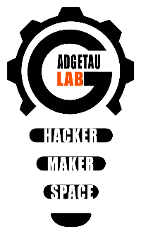

# 🖼️ Pimmich – Cadre photo connecté intelligent

Pimmich est une application Python conçue pour transformer un Raspberry Pi en un cadre photo numérique intelligent et personnalisable. Il peut afficher des photos depuis de multiples sources, être contrôlé à la voix, et bien plus encore.


---

## 📖 Table des matières

- [✨ Fonctionnalités Principales](#-fonctionnalités-principales)
- [🧰 Technologies utilisées](#-technologies-utilisées)
- [🚀 Installation](#-installation)
- [🔧 Configuration](#-configuration)
- [🗣️ Contrôle Vocal](#️-contrôle-vocal)
- [❓ Dépannage (FAQ)](#-dépannage-faq)
- [🛣️ Feuille de Route](#️-feuille-de-route)
  - [Juin 2025](#-juin-2025-)
  - [Juillet 2025](#-juillet-2025---version-actuelle)
  - [Août 2025](#️-août-2025----sortie-prévue-le-15-aoüt)
- [💖 Crédits](#-crédits)

---

## ✨ Fonctionnalités Principales

Pimmich est riche en fonctionnalités pour offrir une expérience complète et personnalisable :

#### 🖼️ **Affichage & Diaporama**
- **Multi-sources :** Affichez des photos depuis [Immich](https://immich.app/), un partage réseau (Samba/Windows), une clé USB, un smartphone ou via Telegram.
- **Personnalisation avancée :** Réglez la durée d'affichage, les heures d'activité, les transitions (fondu, glissement), et activez un effet de mouvement "Pan & Zoom".
- **Filtres créatifs :** Appliquez des filtres à vos photos (Noir & Blanc, Sépia, Vintage) et des effets uniques comme le **Polaroid** ou la **Carte Postale**.
- **Gestion des formats :** Prise en charge intelligente des photos portraits (fond flou) et des vidéos (avec son et accélération matérielle optionnelle).

#### ⚙️ **Interface & Contrôle**
- **Interface Web complète :** Une page de configuration locale, sécurisée par mot de passe et organisée en onglets clairs (Diaporama, Contenu, Interactions, Maintenance).
- **Contrôle Vocal :** Pilotez votre cadre avec des commandes vocales comme *"Cadre Magique, photo suivante"* ou *"Cadre Magique, lance la playlist Vacances"*.
- **Gestion de contenu :**
    - **Playlists :** Créez des albums virtuels, réorganisez les photos par glisser-déposer et lancez des diaporamas thématiques.
    - **Favoris :** Marquez vos photos préférées pour qu'elles apparaissent plus souvent.
    - **Légendes :** Ajoutez du texte personnalisé sur vos photos et cartes postales.

#### 🌐 **Connectivité & Interactions**
- **Telegram :** Permettez à vos proches d'envoyer des photos sur le cadre via un bot Telegram, avec un système d'invitations sécurisé et temporaire.
- **Wi-Fi & Réseau :** Configurez le Wi-Fi, scannez les réseaux et gérez les interfaces réseau directement depuis l'interface.
- **Envoi depuis Smartphone :** Importez des photos directement depuis le navigateur de votre téléphone.

#### 🛠️ **Maintenance & Monitoring**
- **Mise à jour facile :** Mettez à jour Pimmich en un clic depuis l'interface.
- **Sauvegarde & Restauration :** Sauvegardez et restaurez l'ensemble de votre configuration.
- **Monitoring système :** Suivez en temps réel la température, l'utilisation du CPU, de la RAM et du disque avec des graphiques d'historique.
- **Logs détaillés :** Accédez aux journaux de chaque service (serveur web, diaporama, contrôle vocal) pour un dépannage facile.

---

## 🧰 Technologies utilisées

- **Backend :** Python, Flask
- **Frontend :** HTML, TailwindCSS, JavaScript
- **Diaporama :** Pygame
- **Traitement d'image :** Pillow
- **Contrôle Vocal :** Picovoice Porcupine (mot-clé) & Vosk (reconnaissance)
- **Serveur Web :** NGINX (en tant que reverse proxy)

---

## 🚀 Installation

Il existe deux méthodes pour installer Pimmich.

### Méthode 1 : Image pré-configurée (Recommandée et plus simple)

Cette méthode est idéale pour une première installation rapide.

1.  **Téléchargez l'image du mois en cours**
    Rendez-vous sur la page des [Releases de Pimmich](https://github.com/gotenash/pimmich/releases) et téléchargez le fichier `.img` de la dernière version.

2.  **Flashez l'image sur une carte SD**
    Utilisez un logiciel comme Raspberry Pi Imager ou BalenaEtcher pour écrire le fichier image que vous venez de télécharger sur votre carte microSD.

3.  **Démarrez votre Raspberry Pi**
    Insérez la carte SD dans le Raspberry Pi, branchez l'écran et l'alimentation. Pimmich démarrera automatiquement.

### Méthode 2 : Installation manuelle depuis le dépôt Git

Cette méthode est destinée aux utilisateurs avancés ou à ceux qui souhaitent suivre le développement de près.

#### ✅ Pré-requis

- Un Raspberry Pi (modèle 3B+, 4 ou 5 recommandé) avec Raspberry Pi OS Desktop (64-bit).
- Une carte SD, une alimentation, un écran.
- Une connexion Internet.

#### 📝 Étapes d'installation

1.  **Clonez le dépôt**
    Ouvrez un terminal sur votre Raspberry Pi et exécutez :
    ```bash
    git clone https://github.com/gotenash/pimmich.git
    cd pimmich
    ```

2.  **Lancez le script d'installation**
    Ce script installe toutes les dépendances, configure l'environnement et prépare le démarrage automatique.
    ```bash
    chmod +x setup.sh
    sudo ./setup.sh
    ```

3.  **Redémarrez**
    Une fois le script terminé, un redémarrage est nécessaire pour que tous les services se lancent correctement.
    ```bash
    sudo reboot
    ```

---

## 🔧 Configuration

### 1. Première Connexion

- Au redémarrage, le cadre affichera un QR Code et l'adresse IP du Raspberry Pi.
- Scannez le QR Code ou ouvrez un navigateur sur un autre appareil (PC, smartphone) sur le même réseau et entrez l'adresse IP (ex: `http://192.168.1.XX`).
- Le mot de passe initial est généré aléatoirement lors de l'installation et est stocké dans le fichier `/boot/firmware/credentials.json`. Il est fortement recommandé de le changer via l'interface (onglet `Système` > `Sécurité`).

### 2. Configuration des Sources

- **Immich :** Pour connecter votre serveur Immich, vous aurez besoin de :
    1.  **L'URL de votre serveur** (ex: `http://192.168.1.YY:2283`).
    2.  **Un Token API :** Dans Immich, allez dans `Paramètres du compte` > `Clés API` > `Générer une nouvelle clé`.
    3.  **Le nom technique de l'album** que vous souhaitez afficher.
- **Samba / Partage Windows :** Renseignez les informations de votre partage réseau.
- **USB :** Branchez une clé USB et utilisez le bouton d'import dans l'onglet `Actions`.

### 3. Personnalisation

Explorez les différents onglets pour personnaliser votre cadre :
- **Diaporama > Affichage :** Réglez les durées, les transitions, les effets...
- **Diaporama > Horloge & Infos :** Activez et configurez l'affichage de l'heure, de la météo ou des marées.
- **Contenu > Sources :** Cochez les sources que vous souhaitez voir dans le diaporama.

---

## 🗣️ Contrôle Vocal

Pimmich supporte le contrôle vocal en **Français** et en **Anglais**.

Pour utiliser un mot-clé personnalisé ("Cadre Magique", "Magic Frame"...), une étape manuelle est requise :
1.  Créez un compte gratuit sur la Picovoice Console.
2.  Allez dans la section "Porcupine" et créez votre mot-clé personnalisé.
3.  Téléchargez le modèle pour la plateforme **Raspberry Pi**.
4.  Renommez le fichier `.ppn` téléchargé en `cadre-magique_raspberry-pi.ppn` (pour le français) ou `magic-frame_raspberry-pi_en.ppn` (pour l'anglais, exemple).
5.  Placez ce fichier dans le dossier `voice_models` à la racine du projet Pimmich.
6.  Dans l'interface Pimmich, allez dans l'onglet `Vocal`, sélectionnez la langue, entrez votre "Access Key" Picovoice et activez le service.

### Commandes Disponibles

Une fois le contrôle vocal activé, commencez toutes vos commandes par le mot-clé **"Cadre Magique"**.

**Contrôle du Diaporama :**
- *"photo suivante"*
- *"photo précédente"*
- *"pause"* / *"lecture"* (pour mettre en pause ou reprendre)

**Gestion de l'Affichage :**
- *"règle la durée à 15 secondes"*
- *"affiche pendant 30 secondes"*

**Gestion des Playlists & Sources :**
- *"lance la playlist Vacances"*
- *"afficher les cartes postales"* (lance un diaporama des photos Telegram)
- *"activer la source Samba"*
- *"désactiver la source USB"*

**Contrôle du Système :**
- *"passer en mode veille"* (éteint l'écran)
- *"réveiller le cadre"* (rallume l'écran)
- *"éteindre le cadre"* (éteint complètement le Raspberry Pi)
- *"revenir au diaporama principal"* (quitte une playlist et relance le diaporama normal)

---

## ❓ Dépannage (FAQ)

Pour toute question ou problème, consultez notre **Foire Aux Questions (FAQ.md)**. Vous y trouverez des solutions aux problèmes courants (Wi-Fi, affichage, etc.) et des astuces pour utiliser Pimmich au mieux.

---

## 🛣️ Feuille de Route

Voici un aperçu des fonctionnalités à venir :

- **Octobre 2025 :**
  - 📱 Création d’une application Android "télécommande" pour contrôler le cadre.
  - 🔘 Gestion d'un bouton physique pour interagir avec le diaporama.

- **Idées pour le futur :**
  - 📺 Version pour Android TV.
  - ☁️ Import depuis d'autres services comme Google Photos ou PhotoPrism.

---

## 💖 Crédits

- **Auteurs :** Gotenash et Shenron
- **Projet du :** Gadgetaulab

<p align="center">
  <a href="https://www.gadgetaulab.fr">
    
  </a>
</p>


> 🗓️ À partir de juin 2025 — Une version majeure chaque mois

## 🗓️ Octobre 2025 - (En cours de développement)
- 📱 Création d’une APK Android pour contrôler le cadre (Pimmich télécommande)
- 🗣️ Ajout de la commande vocale ("Cadre Magique") pour piloter le cadre (photo suivante, pause, etc.).
- 🔘 Gestion d'un bouton physique pour démarrer/arrêter le diaporama.
- 🗂️ Gestion des albums directement depuis l'interface Pimmich (créer, renommer, etc.).

## ✅ Septembre 2025 - (Sortie prévue le 15 septembre)
- 🎨 **Refonte de l'Interface :** Nouvelle navigation par groupes et onglets pour une expérience plus claire et intuitive.
- 🎵 **Gestion de Playlists Améliorée :**
    - ✅ Nouvel écran de lancement dynamique avec un pêle-mêle de photos sur un fond en liège.
    - ✅ Créez des albums virtuels, visualisez leur contenu, renommez-les et lancez des diaporamas thématiques.
- 🗣️ **Amélioration du Contrôle Vocal :**
    - ✅ Ajout de la commande "Revenir au diaporama principal".
    - ✅ Fiabilisation du lancement des playlists par la voix.
- 📊 **Monitoring Avancé :** Ajout de graphiques d'historique pour la température, l'utilisation du CPU, de la RAM et du disque.
- 🖥️ **Gestion de l'Affichage :** Possibilité de lister et de forcer une résolution d'écran spécifique directement depuis l'interface.
- 💾 **Extension du Stockage :** Ajout d'un outil dans l'interface pour étendre facilement le système de fichiers.
- 🚀 **Optimisations et Stabilité :**
    - ✅ Amélioration de la réactivité de l'onglet "Système" grâce à une lecture optimisée des logs.
    - ✅ Fiabilisation du script de mise à jour pour éviter les blocages.
    - ✅ Nombreuses corrections de bugs pour une meilleure stabilité générale.

## 🛠️✅ Août 2025  - (Version précédente)

- ✅ Gestion des vidéos
- ✅ Ajout d'une vignette lors de lecture de la vidéo (onglet Actions)
- ✅ Ajout de la fonction "Carte Postle" par telegram
    - ✅ sécurisation par lien d'invitation
- ✅ Gestion accélération matérielle pour Pi3
- ✅ Ajout traduction de l'application (Anglais et Espagnol)
- ✅ Ajout QR Code première connexion
- ✅ Ajout de l'effet "Carte postale" pour toutes les sources de photos
- ✅ Ajout de la fonctionnalité "Ajout de texte"
- ✅ Ajout d'un bouton "Redémarrer l'appli Web"
- ✅ Ajout de l'onglet Favoris (augmentation fréquence d'affichage d'une photo)
- ✅ Modification météo et marées pour afficher 3 jours de prévisions
- ✅ Corrections des bugs
    - ✅ Heure début d'affichage
    - ✅ Effacement des logs dans l'onglet système sans problème de container


## ✅ Juillet 2025  - Version actuelle

- ✅ 🧭 Ajout de la configuration Wi-Fi depuis l’interface Web  
- ✅ 🗂️ Réorganisation de la page de configuration en onglets  
- ✅ 🔁 Mise à jour automatique périodique de l’album Immich  
- ✅ 📁 Support du protocole SMB pour accéder à des photos partagées en réseau
- ✅ ⏰🌤️ Affichage de l’heure et de la météo sur l’écran
- ✅ Ajout NGINX, plus besoin de mettre le numéro du port (50000)
- ✅ Ajout des filtres (NB, Sépia, Polaroid ...)
- ✅ Ajout des différents boutons supprimer
- ✅ Ajout d'une option de sauvegarde de la configuration
- ✅ Ajout d'un menu changement du mot de passe
- ✅ Ajout de la création du credenrials.json pendant le setup
- ✅ Ajout effet de transition
- ✅ Ajout détection automatique de la résolution
- ✅ Ajout de l'import à partir d'un smartphone (en admin et mode invité)
- ✅ Interface de validation des photos proposées en mode invité
- ✅ Ajout des logs dans l'onglet Système
- ✅ Ajout des stats du Raspberry (température, stockage Ram, charge processeur)

## ✅ Juin 2025 –

- ✅ Aperçus des photos avec suppression possible  
- ✅ Véritable mise en veille de l’écran (gestion via `wlr-randr`)  
- ✅ Paramètre de hauteur utile de l’écran (% d’écran utilisé)  
- ✅ Correction de l’orientation via EXIF et préparation des images  


 
## 💡 Idées pour les versions suivantes

- 📱 Création d’une APK Android pour contrôler le cadre 
- Pimmich télécomande
- Pimmich Android TV
- Import Google Photos
- Import PhotoPrism    


### Récupérer la Clef API (Token Immich)

🧭 1. Se connecter à l'interface web d’Immich

⚙️ 2. Accéder à la page "Paramètres du compte"
Une fois connecté :

Clique sur l’icône de profil (en haut à droite) ou ton nom d'utilisateur.


Sélectionne “Account settings” ou “Paramètres du compte”.


🧪 3. Générer un nouveau token API
Dans la section "API Key" ou "Clés API" :


Clique sur “Generate new API Key” ou “Générer une nouvelle clé API”.


Donne un nom à ta clé, par exemple :
PimmichFrame

✅ Une fois générée, une clé s'affiche. C’est le token à copier.


⚠️ Attention

Tu ne pourras plus voir cette clé après avoir quitté la page. Si tu la perds, il faudra en générer une nouvelle.

Ne partage jamais ce token publiquement. Il donne un accès total à tes albums Immich.

Le mieux est de créer un compte Immich réservé au cadre photo avec accès à un seul album que tu pourras alimenter à partir d'un autre compte.

### Se connecter à Pimmich

Dans un navigateur taper l'adresse ip du raspberry : http://xxx.xxx.xxx.xxx:5000


### Page de configuration

## configuration du diaporama

Dans ce cadre vous pourrez régler le temps d'affichage de chaque photo (pour l'instant on ne peut descendre en dessous de 10 secondes surement du temps de traitement des photos porttrait pour générer le fond flou). Vous pouvez aussi défoinir les heures où le diaporama fonctionnera.


## configuration de l'import des photos


